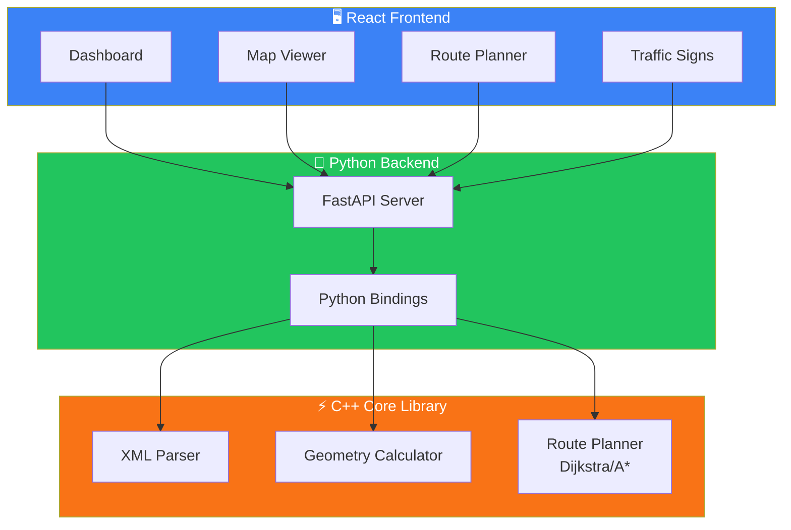
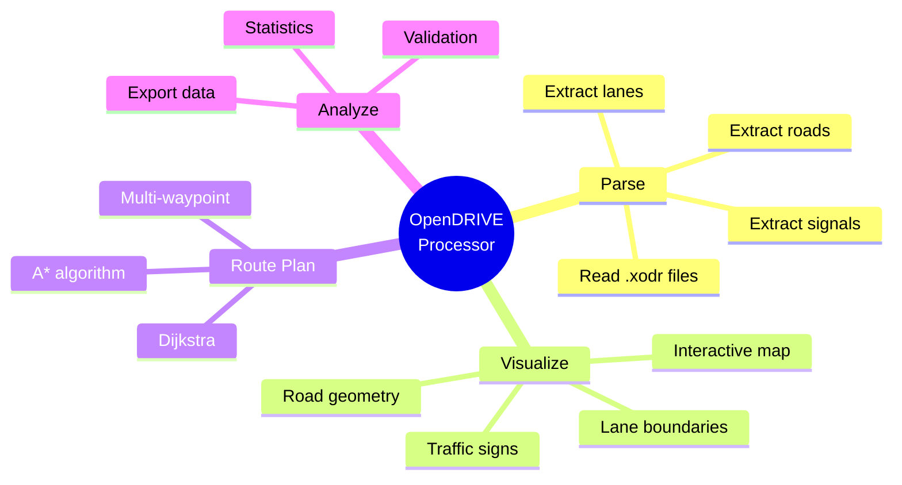
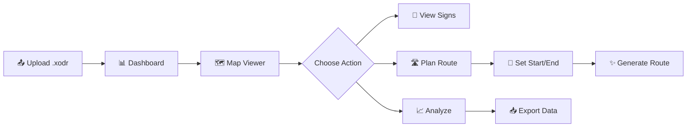
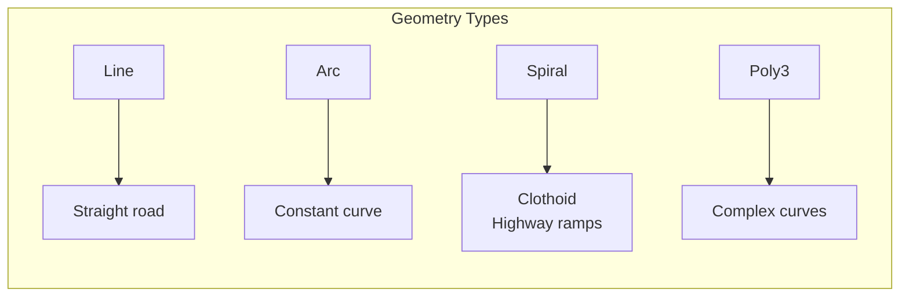

# OpenDRIVE Road Network Processor

A comprehensive tool for parsing, visualizing, and route planning on OpenDRIVE HD maps. Built with C++ for performance-critical parsing and Python/React for flexibility and modern UI.

## What is OpenDRIVE?

**OpenDRIVE** is a standard format for HD (High Definition) maps used in autonomous driving. Unlike regular navigation maps, OpenDRIVE contains precise information about:
- 🛣️ Exact road geometry (curves, slopes, elevation)
- 🚗 Lane layouts (width, type, direction)
- 🚦 Traffic signs and signals
- 🔀 Junction connections

This tool helps engineers **parse**, **visualize**, and **analyze** these complex maps.

## Architecture



## Features



### C++ Core Library
- **OpenDRIVE Parser**: Full support for OpenDRIVE 1.4-1.6 format
- **Geometry Calculator**: Accurate clothoid/spiral curve computation
- **Route Planner**: Dijkstra and A* pathfinding algorithms

### Python Backend
- FastAPI REST API
- Map upload and management
- Pure Python fallback (no C++ required)

### React Frontend
- Interactive map visualization
- Road and lane geometry display
- Route planning interface

## User Flow



## Prerequisites

### C++ Build
- CMake 3.15+
- C++17 compiler (GCC 8+, Clang 7+)
- TinyXML2 library
- pybind11 (for Python bindings)

### Python
- Python 3.9+

### Frontend
- Node.js 18+

## Installation

### 1. Build C++ Library

```bash
cd backend/cpp

# Install dependencies (Ubuntu/Debian)
sudo apt install libtinyxml2-dev python3-pybind11

# Build
mkdir build && cd build
cmake .. -DBUILD_PYTHON_BINDINGS=ON
make -j$(nproc)
```

### 2. Install Python Backend

```bash
cd backend
pip install -r requirements.txt
```

### 3. Install Frontend

```bash
cd frontend
npm install
```

## Running

### Start All Services

```bash
./start.sh    # Starts backend + frontend
./stop.sh     # Stops all services
```

### Manual Start

```bash
# Backend (port 8000)
cd backend/python && python api.py

# Frontend (port 8080)
cd frontend && npm run dev
```

### CLI Tool

```bash
./build/opendrive_cli parse sample.xodr
./build/opendrive_cli validate sample.xodr
./build/opendrive_cli export sample.xodr > roads.csv
```

## API Endpoints

| Method | Endpoint | Description |
|--------|----------|-------------|
| GET | `/maps` | List all maps |
| POST | `/maps/upload` | Upload .xodr file |
| GET | `/maps/{id}` | Get map info |
| GET | `/maps/{id}/roads` | Get road geometry |
| GET | `/maps/{id}/signals` | Get traffic signals |
| POST | `/maps/{id}/route` | Plan route |

## Project Structure

```
OpenDRIVE Road Network Processor/
├── backend/
│   ├── cpp/
│   │   ├── include/opendrive/    # C++ headers
│   │   ├── src/                  # C++ implementation
│   │   └── bindings/             # pybind11 bindings
│   └── python/
│       └── api.py                # FastAPI backend
├── frontend/
│   └── src/
│       ├── components/           # React components
│       ├── pages/                # Page components
│       └── hooks/                # API hooks
├── samples/                      # Sample OpenDRIVE files
└── README.md
```

## Supported Geometry Types



| Type | Description | Use Case |
|------|-------------|----------|
| Line | Straight segment | City streets |
| Arc | Constant curvature | Roundabouts |
| Spiral | Clothoid curve | Highway ramps |
| Poly3 | Cubic polynomial | Complex intersections |

## License

MIT License

## References

- [ASAM OpenDRIVE Specification](https://www.asam.net/standards/detail/opendrive/)
